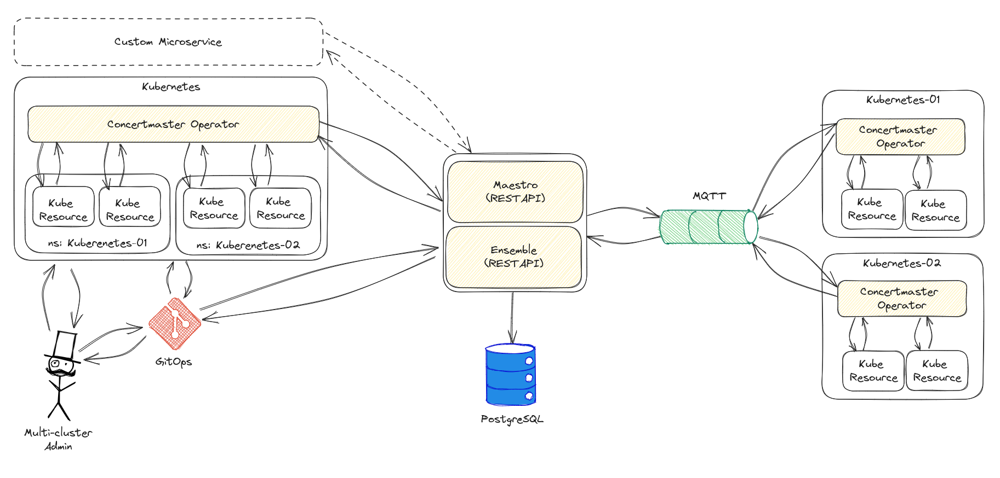

# Sonata

Sonata is a component of the Kube Orchestra Project, a multi-cluster resources orchestrator for Kubernetes.

Sonata is the bridge Operator to provide a Kubernetes API on top of the Maestro and Ensemble APIs. Administrator might prefer to deal with Kubernetes APIs instead of a REST API, Sonata solves that problem.

## Kube Orchestra Architecture

